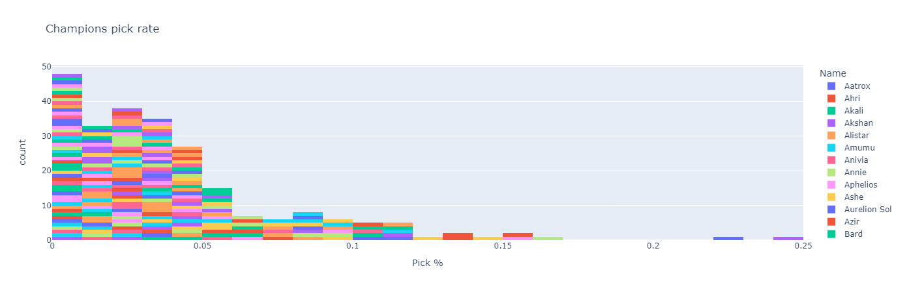

# League Of Legends Data Analysis Project

## Context

* This project focuses on data analysis within the popular online multiplayer game, League of Legends. 
* The analysis aims to provide insights into statistics, to identify which champions are performing well in Season 13.21. 
* Whether you're a League of Legends enthusiast or a data analyst, this project offers valuable information about the game.
* The goal is to have insights to help gain a competitive advantage over other players.

## Data Source

Data from [METAsrc](https://www.metasrc.com/lol/stats).

Please note that this analysis is based on publicly available data sources.

## Content

This dataset contains champion stats from ranked League of Legends matches.
Columns' description are listed below:
* Name : Name of the champion
* Role : Top, Mid, ADC, Support or Jungle
* State : God, Strong, Good, Fair, Weak, Bad
* Tier : S+, S, A, B, C or D
* Score : Overall score of the champion
* Trend : Trend of the score
* Win % : Win rate of the champion
* Role % : Role rate played with the champion
* Pick % : Pick rate of the champion
* Ban % : Ban rate of the champion
* KDA : (Kill+Death)/Assist ratio of the champion

## Project Highlights

- **Champion Performance Analysis:** Discover which champions have the highest win rate, play rate, ban rate in game. Compare champions pick rate versus ban rate, win rate versus ban rate, and role win rate.

* Champions have the highest win rate:

* Champions have the highest play rate:

* Champions have the highest ban rate:

* Overall roles win rate:

* Champions pick rate versus ban rate:

* Champions win rate versus ban rate:

## Acknowledgements

* This analysis is adataset comprised records from over 100,000+ games, analysis on 166 League of Legends champions, encompassing various roles, aiming to provide an overview of champion performance across different roles which result in valuable insights for League of Legends players looking to improve their win rate in Season 13.21.
* By leveraging these insights, I formulated various strategies capitalizing on the abnormal strengths of League of Legends champions in the current season to gain a competitive advantage over other players.
* My overall win rate has increased by 8% from 53%.

## Limitations:
* There are many limitations in this analysis because it yet to give in-dept insights about itemization and which champions can pair up with others thanks to their unique interact with each other.
* The analysis also lack data integrity because many players might not public their personal matches so some champions might have a slightly higher win rate than other champsions.
* The dataset synthesized information from different rank levels so many champions might not be the best for certain rank to use because the skill ceiling of them might be too high.

## Outcome:

Based on the analysis conducted, a newly introduced champion named Briar, designated for the "Jungle" role, demonstrates an unexpectedly high win-rate coupled with a notable ban-rate. This suggests that her performance significantly surpasses that of other champions within the League of Legends roster.

Finally, I hope you find this League of Legends analysis insightful and enjoyable. Have a wonderful day :D
